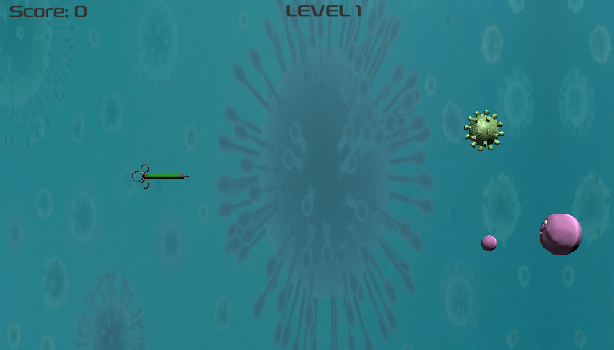

# Coronavirus Shooter

## Overview

**Coronavirus Shooter** is a 2D arcade-style game that reimagines the classic space shooter genre with a pandemic-inspired twist. Players take control of a heroic medical syringe tasked with eliminating waves of coronavirus particles across multiple levels.

The game offers fluid controls, progressively challenging enemies, and a user-friendly interface—all presented with a stylized, health-themed visual design.

**[Play Now – Launch the Game Online](https://afroditikalantzi.github.io/Coronavirus-Shooter/)**

> *Note: For the best experience, it is recommended to play in fullscreen mode due to a known display bug.*

  
  

  <em>Left: Start screen | Right: In-game action</em>

## Features

- **Medical-Themed Gameplay**: Control a syringe to combat viral enemies  
- **Multiple Enemy Types**:
  - Standard floating coronavirus particles  
  - Advanced virus enemies with projectile attacks  
- **Level Progression**: Two fully playable levels with increasing difficulty  
- **Player Interface**: Real-time score display, level info, and game-over screen  
- **Smooth Controls**: Movement via keyboard; shooting with spacebar or mouse  
- **Restart Options**: Retry the level or return to the main menu after defeat  

## How to Play

- **Move**: Arrow keys or **WASD**  
- **Shoot**: Spacebar or left mouse button  
- **Objective**: Eliminate all enemies while avoiding incoming attacks  
- **Scoring**: Earn points by destroying virus particles  
- **Progression**: Complete each level to advance  

## System Architecture

- **Game Engine**: Unity  
- **Programming Language**: C#  

## Planned Enhancements

- Additional levels with ramping difficulty  
- New enemy types with unique movement and attack patterns  
- Player power-ups and special abilities  
- Boss encounters  
- Online leaderboard system  

## Credits

- **3D Models**: [TurboSquid](https://www.turbosquid.com)  
- **Sound Effects**: [Pixabay](https://pixabay.com)  
- **Backgrounds**: Google Images  
- **Font**: [DaFont](https://www.dafont.com)  

> *This game was created as an educational project and is not intended to diminish the seriousness of the COVID-19 pandemic.*
